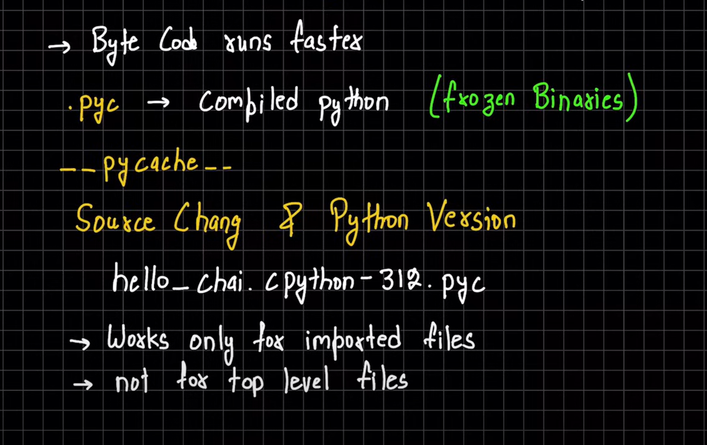
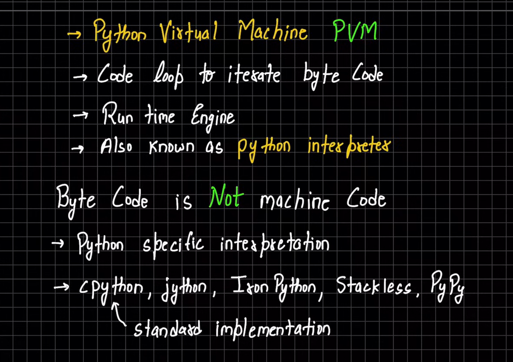

## What is Python?

__*ython is a high-level, interpreted, and general-purpose programming language. It was created by Guido van Rossum and first released in 1991. Python emphasizes code readability and simplicity, making it an excellent language for beginners and experienced developers*__

>  studied from hitesh sir chai and code :
> <https://www.youtube.com/watch?v=OEKrDogH5ew&list=PLu71SKxNbfoBsMugTFALhdLlZ5VOqCg2s&index=4&ab_channel=ChaiaurCode>
### Inner working of python : 


### working of python virtual machine 

### It is used for:
 - web development (server-side),
 - software development,
 - mathematics,
 - system scripting.
 - game development
  

 1. `Simple and Easy to Learn:` 
 2. `Interpreted`: Python is an interpreted language, which means that the Python code is executed line by line. This makes it easy to test and debug code.
 3. `High-Level`: Python is a high-level language, which means that it abstracts away low-level details like memory management and hardware interaction. This makes it easier to write and understand code.
 4. `Dynamic Typing`: Python is dynamically typed, which means that you don’t need to declare the data type of a variable explicitly. Python will automatically infer the data type based on the value assigned to the variable.
 4. `Strong Typing`: Python is strongly typed, which means that the data type of a variable is enforced at runtime. This helps prevent errors and makes the code more robust.
 6. `Extensive Standard Library`: Python comes with a large standard library that provides tools and modules for various tasks, such as file I/O, networking, and more. This makes it easy to build complex applications without having to write everything from scratch.
 7. `Cross-Platform`: Python is a cross-platform language, which means that Python code can run on different operating systems without modification. This makes it easy to develop and deploy Python applications on different platforms.
 8. `Community and Ecosystem`: Python has a large and active community, which contributes to its ecosystem. There are many third-party libraries and frameworks available for various purposes, making Python a versatile language for many applications.
 9. `Versatile`: Python is a versatile language that can be used for various purposes, including web development, data science, artificial intelligence, game development, and more.

### python shell

__*Python Shell is used to test Python code or as a learning tool. It is a complete Python interpreter in a drop-down window Features:*__


```
>>> import os
>>> os.getcwd()
'C:\\Users\\golu\\OneDrive\\Desktop\\python\\class\\01_basics'

>>> import sys
>>> sys.platform
'win32'

>>> for c in "student" :
...     print(c)
...
s
t
u
d
e
n
t
```
how import and function use of modules work . Module are pre-written code by others we just import them and use their functions using .(dot) 

Eg :  form basics folder 
```
>>> import hello_chai
chai aur python
lemon tea
>>> hello_chai.chai("chai for Golu")
chai for Golu
>>>
```
#### if we are working on shell and did some changes in file , which was imported in this/current file then `changes will not reflected` . so to see changes we have to close the shell and come back .
*But python provide a solution for this . so instead of doing above we can use a command  :* 

```
from importlib import reload
reload(file_name)
```


# Data types in python 

## *Python has several built-in data types that allow you to work with different kinds of values*
 ### 1. Numeric Data Types:

 - __*Integers (int):*__ Represent positive or negative whole numbers without fractions or decimals. There’s no limit to the length of an integer value in Python.
  
 - __*Floating-Point Numbers (float):*__ Represent real numbers with a decimal point. They are accurate up to 15 decimal places.

 - __*Complex Numbers (complex):*__ Represent numbers in the form (real part) + (imaginary part)j.
 - 
**Example:**

```
a = 5
print("Type of a:", type(a))  # Output: Type of a: <class 'int'>

b = 5.0
print("\nType of b:", type(b))  # Output: Type of b: <class 'float'>

c = 2 + 4j
print("\nType of c:", type(c))  # Output: Type of c: <class 'complex'>

```
### 2. Sequence Data Types:
   
 - __*List (list):*__  An ordered collection of similar or different items, enclosed in square brackets ([]).
  
 - __*Tuple (tuple):*__ Similar to a list but immutable (cannot be modified once created), enclosed in parentheses (()).
  
 - __*Range (range):*__ Represents an arithmetic progression of integers.
  
  **Example :**
  ```
  languages = ["Swift", "Java", "Python"]
print(languages[0])  # Output: Swift
print(languages[2])  # Output: Python

  ```

### 3. Mapping Data Type:
 - __*Dictionary (dict):*__ Holds data in key-value pairs. Keys are unique and associated with corresponding values.

### 4. Boolean Data Type:
 - __*Boolean (bool):*__ Represents either True or False.

### 5. Set Data Types:
 - __*Set (set):*__ Holds a collection of unique items.
 - __*FrozenSet (frozenset):*__ Similar to a set but immutable.
  ### 6. None : no value 
          Eg : We are calling weather API anbd we don't get any value then we can't just write 0 , so None is used 

`Remember, Python treats everything as an object, and data types are actually classes. Variables are instances (objects) of these classes. You can use the type() function to determine the data type of a variable.`

## mutable and Immutable  : 
Mutable objects in Python are those that can be changed after they are created, like lists or dictionaries. Immutable objects, on the other hand, cannot be changed after they are created, such as strings, integers, or tuples.


 __*`Actual meaning of mutable and Immutable is that is there any change in internal memory refrence of the objects : If changing  value without creating new refrence that means it's Mutable and if it's change the refrence to change or modify the value it's Immutable `*__


## Intresting codes
```
>>> repr('golu')
"'golu'"
>>> str('golu')
'golu'
>>> print('golu')
golu
```

```
>>> import math
>>> math.floor(3.9)
3
>>> math.floor(-4.2)
-5
```
### conversion between decimal and binary , octal , hexadecimal : 
```
>>> 0o20
16
>>> 0xFF
255
>>> 0b1000
8
>>> oct(64)
'0o100'
>>> hex(64)
'0x40'
>>> bin(64)
'0b1000000'
```
we can also do conversion like this : **type_to_Convert (vale , base)**
```
>>> int('64',8)
52
>>> int('64',16)
100
>>> int('10000',2)
16
```

### Bitwise shift :
#### *left shift* : << (multiply the number by 2^number_of_bit_to_shift)
#### *right shift* : >> (devide the number by 2^number_of_bit_to_shift)
```
>>> x = 1
>>> x << 2
4
>>> y = 16
>>> y >> 2
4
```

### random module
```
>>> import random

>>> random.random()
0.12871868823699506

>>> random.randint(1,8)
5
>>> l1 = ['golu' , 'vishal' , ' zishan' ,'priyanshu']
>>> random.choice(l1)
'vishal'

>>> random.shuffle(l1)
>>> l1
['vishal', ' zishan', 'priyanshu', 'golu']

>>> random.shuffle(l1)
>>> l1
[' zishan', 'vishal', 'priyanshu', 'golu']

```

### *WT Values :*
```
>>> 0.1 + 0.2 + 0.3
0.6000000000000001

>>> 0.1 + 0.1 + 0.1 - 0.3
5.551115123125783e-17

>>> (0.1 + 0.1 + 0.1) - 0.3
5.551115123125783e-17

`how both can have same value . Where is the Maths ?`
```

### Solution : 

```
>>> from decimal import Decimal
>>> Decimal('0.1') + Decimal('0.1') + Decimal('0.1') - Decimal('0.3')
Decimal('0.0')
```

### set in python 
```
>>> set = {1,2,3,3,4}
>>> set & {1,2}
{1, 2}

>>> set | {2,3,4,5,6,7}
{1, 2, 3, 4, 5, 6, 7}

>>> set - {1,2}
{3, 4}

>>> set - {1,2,3,4}
set()

>>> type({})
<class 'dict'>
>>>
```
### *`Above we get set() , when set was empty Because {} belongs to dict class (dictionary)`* 

### Boolean 
```
>>> type(True)
<class 'bool'>

>>> True == 1
True

>>> False == 0
True

>>> True is 1
<stdin>:1: SyntaxWarning: "is" with a literal. Did you mean "=="?
False

>>> True
True

>>> True + 4
5

>>> False - 3
-3

>>> False + 2
2
```

### *Hense : True and False is Treated as 0 and 1 . But doesn't represent same Reffrence*

## String in python 
In Python, strings are used for representing textual data. A string is a sequence of characters enclosed in either single quotes ('') or double quotes (“”).

#### *Imp codes :*
```
>>> name = "golu kumar"
>>> name
'golu kumar'

>>> print(name)
golu kumar

>>> print(name.upper())
GOLU KUMAR

>>> print(name.lower())
golu kumar

>>> print(name.replace("kumar","Singh"))
golu Singh

>>> nam = "   golu  kumar "
>>> print(nam)
   golu  kumar

>>> print(nam.strip())
golu  kumar

>>> first_char = name[0]
>>> print(first_char)
g

>>> slice_first_name = name[0:4]
>>> print(slice_first_name)
golu
```
#### *string slicing :*
```
>>> num = "0123456789"
>>> num[:]
'0123456789'

>>> num[4:]
'456789'

>>> num[:6]
'012345'

>>> num[2:8:2]
'246'

>>> num[::3]
'0369'

>>> num[::]
'0123456789'

>>> num[:-1]
'012345678'

>>> num[::-1]
'9876543210'

>>> num[2:8:-1]
''

>>> num[8:2:-1]
'876543'

>>> num[9:1:-2]
'9753'
```

```
>>> chai = "Lemon , Ginger , Masala , Mint"

>>> print(chai.split())
['Lemon', ',', 'Ginger', ',', 'Masala', ',', 'Mint']

>>> print(chai.split(", "))
['Lemon ', 'Ginger ', 'Masala ', 'Mint']

>>> chai = "Masala Chai"
>>> print(chai.find("Chai"))
7

>>> print(chai.find("chai"))
-1

>>> chai = "Masala Chai chai chai chai"
>>> print(chai.count("chai"))
3
```
### *. format Method:*
```
>>> chai_type = "Masala"
>>> quantity = 2
>>> order = "I ordered {} cups of {} chai"

>>> order
'I ordered {} cups of {} chai'

>>> print(order.format(quantity,chai_type))
I ordered 2 cups of Masala chai
```
### *. join method :*
```
>>> chai_variety = ["Lemon" , "Masala" , "Ginger"]
>>> chai_variety
['Lemon', 'Masala', 'Ginger']

>>> print("".join(chai_variety))
LemonMasalaGinger

>>> print(" ".join(chai_variety))
Lemon Masala Ginger

>>> print(" - ".join(chai_variety))
Lemon - Masala - Ginger
```

`Prpblem  : When we want to use double String inside a String` 
``` chai = "he said , "Masala chai was good""
  File "<stdin>", line 1
    chai = "he said , "Masala chai was good""
                       ^^^^^^
SyntaxError: invalid syntax
```
`Solution  : use r , it's denotes raw formate : jaisa hai waisa ka waisa`
```
>>> chai = r"he said  \"Masala chai was good\""
>>> print(chai)
he said  \"Masala chai was good\"

>>> chai = r"masala \n chai"
>>> print(chai)
masala \n chai
```

### *Same problem with window path slash :*
```
>>> chai = "c:\user\pwd"
  File "<stdin>", line 1
    chai = "c:\user\pwd"
                        ^
SyntaxError: (unicode error) 'unicodeescape' codec can't decode bytes in position 2-3: truncated \uXXXX escape
```
`Solution : `
```
>>> chai = r"c:\user\pwd"
>>> print(chai)
c:\user\pwd
```

